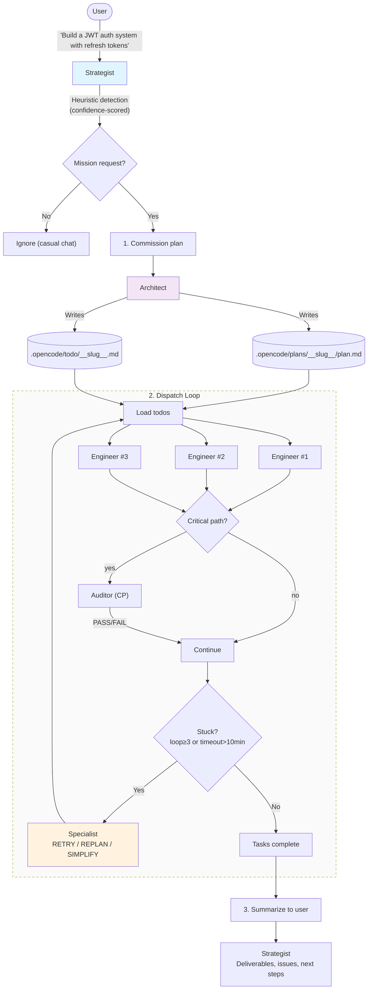

# opencode-ollama-orchestrator

<p align="center">
  <b>Zero-command, fully automatic multi-agent orchestrator for OpenCode.</b><br>
  Provider-agnostic. Works with any model — Ollama, OpenAI, Anthropic, Gemini, and more.
</p>

<p align="center">
  <a href="#quick-start">Quick Start</a> ·
  <a href="#configuration">Configuration</a> ·
  <a href="#how-it-works">How It Works</a> ·
  <a href="#testing">Testing</a> ·
  <a href="#troubleshooting">Troubleshooting</a>
</p>

---

## Philosophy

**No commands. No slash. Just talk.**

Describe what you want in natural language. The Strategist decides if a mission is needed, commissions the Architect, dispatches Engineers in parallel, verifies critical work, and reports back. If anything gets stuck, the Specialist diagnoses and recovers automatically.

You never run `/task`, `/auto`, or anything. Just type naturally.

---

## Quick Start

1. **Install the plugin**

   ```bash
   npm install -g opencode-ollama-orchestrator
   ```

2. **Add to your `~/.config/opencode/opencode.json`**

   ```json
   {
     "plugin": [
       "opencode-ollama-orchestrator"
     ],
     "agent": {
       "strategist": { "model": "deepseek-v4-pro", "temperature": 0.3 },
       "architect":  { "model": "gemini-3-flash-preview", "temperature": 0.8 },
       "engineer":   { "model": "kimi-k2.7-code", "temperature": 0.2 },
       "auditor":    { "model": "kimi-k2.6", "temperature": 0.3 },
       "specialist": { "model": "deepseek-v4-flash", "temperature": 0.4 }
     }
   }
   ```

   Use any provider prefix: `ollama/`, `openai/`, `anthropic/`, `google/`, or omit entirely for local models.

3. **Start OpenCode and talk naturally**

   ```
   "Build a JWT auth system with refresh tokens"
   ```

---

## Features

| Feature | Description |
|---------|-------------|
| **Zero commands** | No `/task`, `/auto`, or slash commands. Natural language input only. |
| **Provider-agnostic** | Works with any model/provider. Uses whatever is configured per agent. |
| **Parallel execution** | Up to 3 engineers run concurrently, with dependency-aware scheduling. |
| **Smart task detection** | Confidence-scoring heuristic rejects casual chat ("ok", "thanks", "explain how X works") and accepts real requests ("build", "fix", "implement"). |
| **Critical-path auditing** | Auditor verifies only mission-critical tasks. ~60% of tasks skip audit for speed. |
| **Anti-stuck system** | Loop detection, timeout watchdog, and Specialist auto-recovery. |
| **Phase gates** | Optional user-controlled pauses between multi-phase plans for review. |
| **Sideline Q\u0026A (`/btw`)** | Ask spark a question mid-mission without interrupting — fire-and-forget read-only session. |
| **State persistence** | Mission state survives conversation compaction via filesystem storage. |
| **DOX integration** | Auto-generates timestamped run records and maintains `AGENTS.md`. |
| **Built-in isolation** | Auto-detects name collisions with OpenCode's built-in agents and renames safely. |

### Operating Modes

| Mode | Best for | Workers | Phase Gates | Human Approval | Hallucination Guard | Token Budget |
|------|----------|---------|-------------|----------------|---------------------|--------------|
| **Slow** (default) | Complex features, architecture changes, full mission pipeline | 3 | Yes | Optional | Off | Unbounded |
| **Fast** | Bug fixes, tests, refactors, linting, docs — run 24/7 autonomously | 1 | No | None | **Pre-write audit** | **Hard ceiling** |

In **Fast Mode** the orchestrator:
- Runs a **watcher loop** that polls for new missions every 5s
- Uses **single-worker execution** (serial, predictable)
- Enforces a **hallucination guard** — every write is validated for file existence, evidence citation, and confidence threshold
- Enforces a **token budget manager** — per-task ceiling + context-window cap with auto-summarize
- Uses **aggressive timeout** (2 min task / 10 min mission)
- Emits **structured JSON logging** and notifications on completion/failure
- Supports **fast-track detection** — quick tasks ("fix typo", "add test", "refactor") skip the full pipeline and run directly

Enable Fast Mode in your config:

```json
{
  "plugin": [
    ["opencode-ollama-orchestrator", {
      "fastMode": {
        "mode": "fast",
        "confidenceThreshold": 0.75,
        "maxTokensPerTask": 4096,
        "enableFastTrack": true
      }
    }]
  ]
}
```

---

## Architecture



---

## Agent Roles

| Agent | Mode | Responsibility | Cost Optimizations |
|-------|------|----------------|-------------------|
| **Strategist** | `primary` | Detect missions, orchestrate flow, summarize results | Only lightweight analysis |
| **Architect** | `subagent` | Write plans and todos | Runs once per mission |
| **Engineer** | `subagent` | Implement code | Parallelized, non-interfering |
| **Auditor** | `subagent` | Verify critical-path tasks | Only audits "critical-path: yes" |
| **Specialist** | `subagent` | Diagnose stuck missions, recover | Activates only on failure |

---

## Configuration

### Minimal Config

```json
{
  "plugin": [
    "opencode-ollama-orchestrator"
  ],
  "agent": {
    "strategist": { "model": "deepseek-v4-pro" },
    "architect":  { "model": "gemini-3-flash-preview" },
    "engineer":   { "model": "kimi-k2.7-code" },
    "auditor":    { "model": "kimi-k2.6" },
    "specialist": { "model": "deepseek-v4-flash" }
  }
}
```

### Full Config with Plugin Options

```json
{
  "plugin": [
    ["opencode-ollama-orchestrator", {
      "maxParallelWorkers": 3,
      "maxRetries": 3,
      "maxSubagentDepth": 2,
      "doxEnabled": true,
      "doxAutoInit": true,
      "doxAutoCloseout": true,
      "defaultAllowLoop": false,
      "defaultLoopCount": 0,
      "verbose": false,
      "requireApproval": false
    }]
  ],
  "agent": {
    "strategist": {
      "model": "deepseek-v4-pro",
      "fallbackModel": "deepseek-v4-flash",
      "smallModel": "gemini-3-flash-preview",
      "temperature": 0.3,
      "topP": 0.9,
      "maxTokens": 8192,
      "mode": "primary",
      "description": "Auto-orchestrator — detects missions, clarifies ambiguity, drives pipeline",
      "skills": ["dox-system"],
      "permission": {
        "read": "allow",
        "task": "allow",
        "skill": { "*": "allow" }
      }
    },
    "architect": {
      "model": "gemini-3-flash-preview",
      "temperature": 0.8,
      "mode": "subagent",
      "permission": {
        "write": { ".opencode/plans/*": "allow", ".opencode/todo/*": "allow", "AGENTS.md": "allow", "*": "deny" },
        "read": "allow",
        "task": "allow",
        "skill": { "*": "allow" }
      }
    },
    "engineer": {
      "model": "kimi-k2.7-code",
      "temperature": 0.2,
      "mode": "subagent",
      "tools": { "bash": true, "edit": true, "write": true },
      "permission": {
        "edit": "allow",
        "bash": "allow",
        "write": "allow",
        "skill": { "*": "allow" }
      }
    },
    "auditor": {
      "model": "kimi-k2.6",
      "temperature": 0.3,
      "mode": "subagent",
      "tools": { "bash": true },
      "permission": {
        "bash": "allow",
        "read": "allow",
        "skill": { "*": "allow" }
      }
    },
    "specialist": {
      "model": "deepseek-v4-flash",
      "temperature": 0.4,
      "mode": "subagent",
      "allowLoop": true,
      "loopCount": 3,
      "permission": {
        "read": "allow",
        "task": "allow",
        "skill": { "*": "allow" }
      }
    }
  }
}
```

### Plugin Options Reference

| Option | Type | Default | Range | Description |
|--------|------|---------|-------|-------------|
| `maxParallelWorkers` | number | `3` | 1–3 | Max concurrent engineer tasks |
| `maxRetries` | number | `3` | 0–5 | Max retries per failed task |
| `maxSubagentDepth` | number | `2` | 1–3 | Max nesting depth for subagent calls |
| `doxEnabled` | boolean | `true` | — | Enable DOX timestamped run records |
| `doxAutoInit` | boolean | `true` | — | Auto-create `.opencode/DOX/` + `AGENTS.md` |
| `doxAutoCloseout` | boolean | `true` | — | Append run summary to `AGENTS.md` on completion |
| `defaultAllowLoop` | boolean | `false` | — | Default loop permission for agents |
| `defaultLoopCount` | number | `0` | 0–5 | Default max loop count |
| `verbose` | boolean | `false` | — | Extra console logging |
| `requireApproval` | boolean | `false` | — | Require approval for shell commands |

---

## How It Works

### Task Detection

The Strategist uses a confidence-scoring heuristic to distinguish real task requests from casual chat:

| Triggers (accept) | Does NOT trigger (reject) |
|-------------------|---------------------------|
| "Build auth system with JWT" | "ok" |
| "Refactor payment module" | "thanks" |
| "Convert this to TypeScript" | "haha" |
| "Fix the bug in login" | "👍" |
| "Help me set up Docker" | "cool" |
| "Create a landing page" | "explain how closures work" |

Messages shorter than 10 chars, system commands starting with `/` or `@`, and common acknowledgements are ignored.

### Parallelism: 3-Worker Limit

The orchestrator enforces a hard cap of 3 concurrent workers (configurable down to 1):

```
Batch 1: TASK-001, TASK-002, TASK-003  ← 3 parallel
Wait for completions...
Batch 2: TASK-004, TASK-005, TASK-006  ← next 3
```

If resource exhaustion is detected (latency spikes), the system temporarily throttles to 1 worker.

### Phase Gates

When the Architect writes a multi-phase plan, you may want to review each phase before the next begins. **Phase gates** give you that control:

| Plan Type | Gate Behavior | User Action |
|-----------|---------------|-------------|
| Single-phase (≤1 phase) | No gates | Fully automatic |
| Multi-phase with `phase-gate: yes` | **Pauses after each phase** | Reply "yes" to continue, "no" to hold |
| Multi-phase without gates | Runs all phases | Fully automatic |

**How it works:**
1. Architect writes plan with `phase-gate: yes` on the last task of each phase
2. Engineer executes tasks within a phase in parallel (up to 3 workers)
3. When a `phase-gate: yes` task completes, the mission enters **HOLD** state
4. Strategist asks: *"Phase 'Setup' is complete. Continue to 'Core Feature'? (yes/no/comment)"*
5. **"yes"** → resume to next phase. **"no"** → mission stays in hold, you can request changes
6. If you request changes during hold, Specialist replans the remaining phases

### Sideline Q\u0026A (`/btw`)

Ask a quick question without interrupting a running mission:

```
/btw what is OAuth2 PKCE?
```

The orchestrator spawns a **Spark** subagent — a read-only Q\u0026A agent — in a separate session:
- No file writes, no edits, no subagent spawning
- Non-blocking: engineers continue working while Spark answers
- Uses your configured `smallModel` (or primary model if none)
- Toast notification when the session starts

```
/btw how does the auth middleware validate tokens?
/btw compare React Server Components vs SSR
```

**Spark permissions:** read, glob, grep, list, webfetch, websearch — and nothing else.

### Anti-Stuck System

The orchestrator watches every task in real time:

| Detection | Threshold | Response |
|-----------|-----------|----------|
| **Task timeout** | > 10 minutes | Spawn Specialist to diagnose |
| **Retry loop** | Same error ≥3 times | Escalate to Specialist, stop brute-force |
| **Circular deps** | Task A → B → A | Detect before dispatch, abort with explanation |
| **All failed** | 100% failure rate | Specialist proposes simplified scope |
| **Stalled** | No progress > 10 min | Throttle workers, check model health |
| **Resource exhausted** | Latency spike > 30s | Drop to 1 worker temporarily |

The Specialist uses a diagnostic protocol:
```
DIAGNOSIS: loop
ROOT_CAUSE: Worker keeps generating invalid syntax for vite.config.ts
RECOMMENDATION: retry_with_changes
REQUIRED_ACTION: Use .mjs extension, avoid ESM/CJS mismatch
CONFIDENCE: high
```

### State Persistence

OpenCode may compact (truncate) conversation history when context windows fill. The orchestrator stores state in the file system so compaction never loses mission progress:

| Source | File | Survives Compaction |
|--------|------|--------------------|
| Mission plan | `.opencode/plans/{slug}/plan.md` | ✅ Yes |
| Task list | `.opencode/todo/{slug}.md` | ✅ Yes |
| Live state | `.opencode/plans/{slug}/state.json` | ✅ Yes |
| Chat history | In-memory (LLM context) | ❌ No — compaction erases this |

After any compaction event, the Strategist re-grounds by re-reading these files before continuing dispatch.

---

## File Layout (Per-Project)

Each mission gets its own directory under `.opencode/`:

```
{project}/
├── .opencode/
│   ├── AGENTS.md                        # DOX contract — seeded with orchestrator agents
│   ├── DOX/
│   │   └── {slug}.md                    # Timestamped run record with tasks, models, status
│   ├── plans/
│   │   └── jwt-auth-system/             # Slugified mission name
│   │       ├── plan.md                  # Architect's full plan
│   │       └── state.json             # Live mission state (atomic writes)
│   └── todo/
│       └── jwt-auth-system.md           # Task list with checkboxes
```

---

## DOX Framework Integration

The plugin auto-integrates with the DOX (Documentation of Execution) framework:

| Feature | Default | Description |
|---------|---------|-------------|
| `doxEnabled` | `true` | Enable DOX timestamped run records |
| `doxAutoInit` | `true` | Auto-create `.opencode/DOX/` + `AGENTS.md` on first mission |
| `doxAutoCloseout` | `true` | Append run summary to `AGENTS.md` on completion |

**Disable DOX:**
```json
{
  "plugin": [
    ["opencode-ollama-orchestrator", {
      "doxEnabled": false
    }]
  ]
}
```

---

## Testing

The plugin ships with **131 Vitest tests** covering all core modules. After installing globally, you can run the tests from the package directory:

```bash
# Find the global install path
npm ls -g opencode-ollama-orchestrator

# cd to that directory and run tests
cd $(npm root -g)/opencode-ollama-orchestrator
npm test
```

### Coverage Summary

| Module | Stmts | Branch | Funcs | Lines |
|--------|-------|--------|-------|-------|
| Agents | 100% | 100% | 100% | 100% |
| Config handler | 82.6% | 85.8% | 100% | 84.4% |
| Event handler | 62.5% | 50% | 71.4% | 55.6% |
| DOX | 100% | 88.9% | 100% | 100% |
| Provider lock | 100% | 100% | 100% | 100% |
| Todo parser | 94.1% | 80% | 75% | 95.7% |

---

## Troubleshooting

### Plugin not loading

**Symptom:** OpenCode starts but no orchestration happens.

1. Verify the plugin is installed:
   ```bash
   npm ls -g opencode-ollama-orchestrator
   ```

2. Check your `opencode.json` has the plugin entry:
   ```json
   "plugin": ["opencode-ollama-orchestrator"]
   ```

3. Ensure the plugin block is an **array** (not an object):
   ```json
   // ✅ Correct
   "plugin": ["opencode-ollama-orchestrator"]

   // ❌ Wrong — must be array
   "plugin": { "opencode-ollama-orchestrator": {} }
   ```

4. Check OpenCode console for warnings like `[opencode-orchestrator] Plugin config missing`.

### Model not found / Unauthorized

**Symptom:** `Error: Unauthorized` or model not found.

1. Verify the model name includes the correct provider prefix:
   ```json
   "model": "ollama/deepseek-v4-pro"   // Ollama Cloud
   "model": "openai/gpt-4o"             // OpenAI
   "model": "anthropic/claude-sonnet-4"  // Anthropic
   ```

2. For Ollama Cloud: ensure your API key is set in `~/.opencode/config.yaml` or environment:
   ```bash
   export OLLAMA_API_KEY=sk-...
   ```

3. The plugin is provider-agnostic — it does not validate model names. The error comes from your provider, not the plugin.

### Missions not detected

**Symptom:** You say "build a login page" but nothing happens.

1. Check if your message is too short (< 10 chars) or contains rejection keywords ("explain", "what is", "how does").
2. Messages starting with `/` or `@` are ignored as system commands.
3. Common acknowledgements ("ok", "thanks", "got it") are ignored.

### Agent name collisions

**Symptom:** Warning `[opencode-orchestrator] Built-in collision: worker -> orchestrator-worker`.

This is expected behavior. The plugin auto-renames orchestrator agents that conflict with OpenCode's built-in agents (`compaction`, `explorer`, `worker`, `executor`, `debugger`). No action needed.

### State file corruption

**Symptom:** Mission resumes from wrong state or errors on load.

The plugin uses atomic writes (write to `.tmp` then rename). If you see corruption, it's likely from a hard crash during a non-atomic external write. Delete the affected `.opencode/plans/{slug}/state.json` and the mission will start fresh.

### Subagent shows "explorer" instead of configured agent

**Symptom:** In auto-pipeline mode, subagent sessions show as built-in `explorer` or `general` with the global default model, ignoring `agent.architect.model`, `agent.engineer.model`, etc.

**Fix:** Upgrade to **v2.1.11+**. Before v2.1.11, `MissionController.createSession()` did not pass `agent` or `model` to OpenCode SDK, so it fell back to built-in defaults. With v2.1.11+, the auto-pipeline resolves per-agent models from your `opencode.json` and logs:
```
[opencode-orchestrator] createSession for engineer with model ollama/kimi-k2.7-code
```

### Todo updates not visible / tasks re-run on resume

**Symptom:** Tasks complete and logs say "TASK-NNN completed", but the todo file still shows `[ ]` unchecked. Resuming the mission re-runs already-done tasks.

**Fix:** Upgrade to **v2.1.11+**. Before v2.1.11, `updateTodoStatus()` hardcoded `.opencode/todos.md` while the architect wrote to `.opencode/todo/{slug}.md`. Updates went to the wrong file. With v2.1.11+, `findTodoFile()` discovers the actual todo file automatically, and `buildTaskPrompt()` tells subagents exactly which file to update.

### Agent asks plain text questions instead of showing modal

**Symptom:** When the strategist or subagent needs user input (e.g., "Proceed?", "Which component?"), it outputs plain text in the terminal. You have to type a free-form answer instead of clicking a choice in an interactive modal.

**Root cause:** The agent prompts told agents to "ask questions" in plain text, but never told them to call the `question` tool. The `question` tool was enabled (`question: true` in tools, `question: "allow"` in permissions), but agents didn't know they should use it.

**Fix:** Upgrade to **v2.2.0+**. All agent prompts now use stronger language: "ALWAYS call the 'question' tool. NEVER write plain text." Additionally, each prompt describes the exact tool signature (message string + options array with label/description fields). This enforces the interactive modal instead of plain text output.

### Mission hangs / model unavailable

**Symptom:** Mission starts but never dispatches tasks. Logs show "createSession primary model failed" with no recovery.

**Fix:** Upgrade to **v2.1.13+**. `createSession()` now catches model errors and tries `fallbackModel` (per-agent config first, then global config). Configure fallback in `opencode.json`:
```json
{
  "agent": {
    "engineer": { "model": "ollama/kimi-k2.7-code", "fallbackModel": "ollama/deepseek-v4-pro" }
  },
  "fallbackModel": "ollama/deepseek-v4-pro"
}
```

### Can't stop a running mission

**Symptom:** A mission is running and you want to cancel it, but there's no command.

**Fix:** Upgrade to **v2.1.13+**. The plugin registers these tools:
- **abort_mission** — Aborts ALL active missions. Call via slash command or agent invocation.
- **skip_task** — Skips a specific task by ID without aborting the whole mission.
- **resume_from** — Resumes from a specific task ID, auto-completing all prior tasks.

### Session stuck / not responding

**Symptom:** A subagent session appears to hang forever. No output for 10+ minutes.

**Fix:** Upgrade to **v2.1.13+**. The watchdog auto-detects sessions idle for >15 minutes and marks them inactive. You can also manually run **check_watchdog** to force a check.

### Mission wrote bad code / need to undo changes

**Symptom:** A mission completed but the code it wrote is broken. You want to undo all changes made during the mission.

**Fix:** Upgrade to **v2.1.14+**. Every mission auto-creates a backup before executing tasks:
- **Git repos:** Uncommitted changes are stashed as `opencode-backup:{slug}:{timestamp}`. Clean working trees get an empty commit marker.
- **Non-git projects:** Files are copied to `.opencode-backups/{slug}-{timestamp}/`.

Call the **revert_mission** tool with the mission slug to restore the pre-mission state. The tool:
1. Aborts the mission
2. Restores files (git stash pop, git reset, or directory copy-back)
3. Deletes the backup to free space

**Note:** If you want to manually revert using OpenCode's built-in tools, use `git stash list` to find the `opencode-backup:*` stash and `git stash pop` it. The orchestrator's stash includes `--include-untracked` so new files are also captured.

### Todo file corrupted during parallel execution

**Symptom:** Running multiple tasks in parallel causes todo file corruption — some tasks appear as both completed and pending, or evidence lines are duplicated.

**Fix:** Upgrade to **v2.1.15+**. All todo updates and mission state saves now use atomic writes (temp file + rename). The `in_progress` status `[~]` is also tracked so you can see which tasks are actively running.

### One task failure aborts entire mission

**Symptom:** A single task fails (engineer error, model timeout, etc.) and the whole mission stops. Other ready tasks never execute.

**Fix:** Upgrade to **v2.1.15+**. Tasks now run in parallel with isolated failure handling. Each task retries independently with exponential backoff. If max retries exceeded, that task is marked failed and the mission continues with remaining tasks. Final state is "completed" if any task succeeds.

### Engineers re-read the same files for every task

**Symptom:** Each engineer session starts from scratch, re-reading files that previous engineers already analyzed. Wastes tokens and time.

**Fix:** Upgrade to **v2.1.15+**. A mission `memory` array accumulates context from completed tasks (last 5 tasks). Each new task prompt includes a "Mission Context (Previous Tasks)" section with summaries, files changed, and issues from prior tasks. Engineers see what was already done and avoid duplicating work.

### Mission directories growing forever

**Symptom:** `.opencode/missions/` accumulates hundreds of directories, consuming disk space.

**Fix:** Upgrade to **v2.1.15+**. Mission directories older than 7 days are automatically cleaned up at startup and daily thereafter.

### Mission lost after OpenCode restart

**Symptom:** You restart OpenCode (or it crashes) and all active missions disappear. You have to start over.

**Fix:** Upgrade to **v2.1.16+**. Missions in `executing`, `hold`, or `retrying` state are automatically restored from `.opencode/missions/*/state.json` on startup. The orchestrator reads the last saved state and brings the mission back as `idle` for you to resume.

### Memory grows unbounded over time

**Symptom:** Long-running OpenCode instances consume increasing memory as missions accumulate.

**Fix:** Upgrade to **v2.1.16+**. Completed missions are purged from memory after 1 hour. Only active and recently-completed missions are kept in the Map.

### SIGTERM kills missions mid-task, files corrupted

**Symptom:** Restarting OpenCode while a mission is running leaves half-written files, broken git state, and no way to recover.

**Fix:** Upgrade to **v2.1.16+**. SIGTERM/SIGINT handlers wait up to 30 seconds for running tasks to complete, then save all active mission states before exiting.

### Model fails repeatedly, wastes tokens on retries

**Symptom:** A model (e.g., a remote API) is down. The orchestrator keeps retrying, burning tokens and money.

**Fix:** Upgrade to **v2.1.16+**. Circuit breaker tracks consecutive failures per model. After 5 failures, the model is permanently skipped and fallback is used immediately. Failure count resets when fallback succeeds.

**Fix:** Upgrade to **v2.1.17+**. Token-bucket rate limiter acquires a token before every session creation. Capacity scales with `maxParallelWorkers`. Default: burst=`workers×2`, refill=`workers`/sec.

### Watchdog marks sessions inactive but they keep running

**Symptom:** Sessions stuck >15 minutes are "marked inactive" but continue consuming tokens.

**Fix:** Upgrade to **v2.1.17+**. Watchdog now calls `client.v2.session.close(...)` to actually terminate stuck sessions. Sends notification on kill.

### No alerts when missions fail overnight

**Symptom:** A mission fails at 3am. You don't find out until morning.

**Fix:** Upgrade to **v2.1.17+**. Configure `notify` in `opencode.json`: ntfy.sh topic or custom webhook. Events: mission started, completed, failed, stuck, backup created.

### Running up a big bill with no visibility

**Symptom:** Hundreds of tokens spent with no log of what happened.

**Fix:** Upgrade to **v2.1.17+**. Structured JSON logs written to `.opencode/logs/orchestrator-{date}.ndjson`. Severity levels: trace/debug/info/warn/error/fatal. 7-day rotation.

### Plan/todo files never created (silent timeout)

**Symptom:** Mission starts, the architect is commissioned, but nothing happens. After ~5 minutes the mission silently dies. No `.opencode/plans/{slug}/plan.md` or `.opencode/todo/{slug}.md` files appear.

**Root cause:** The orchestrator sent **absolute paths** (e.g. `/Users/.../.opencode/plans/slug/plan.md`) to the architect in the prompt, but the architect's `write` permission uses **relative globs** (`.opencode/plans/**`). OpenCode's permission system silently denied the write — no error, no file, no feedback. The `pollForFile()` call then timed out after 150×2s = 5 minutes, and the timeout error was swallowed by the event handler.

**Fix:** Upgrade to **v2.2.1+**. All agent prompts now use relative paths (`.opencode/plans/{slug}/plan.md`) that match the permission globs. The `pollForFile()` timeout is now caught and surfaced as a visible error toast with actionable guidance.

---

## Built-in Agent Isolation

OpenCode ships with built-in subagents (`compaction`, `explorer`, `worker`, `executor`, `debugger`). Our orchestrator agents are completely separate. To prevent collisions:

1. **Auto-rename on collision** — If you name an orchestrator agent `"worker"`, the config handler auto-renames it to `"orchestrator-worker"` and prints a warning. Built-in functionality is never overwritten.
2. **Prompt boundaries** — Every agent prompt instructs: "NEVER interact with built-in OpenCode agents."
3. **Architect naming rule** — Tasks must never be named after built-in agents to avoid namespace confusion.

---

## Changelog

See [CHANGELOG.md](CHANGELOG.md) for full version history.

### Recent Versions

| Version | Date | Highlights |
|---------|------|------------|
| **2.4.0** | 2026-06-18 | God class split: SessionManager + MissionStore extracted, 28 integration tests added |
| **2.3.0** | 2026-06-18 | Major overhaul: 16 critical bug fixes, config caching, dedup, dead code cleanup |
| **2.2.1** | 2026-06-18 | Fix: plan/todo files never created (absolute→relative path mismatch), silent timeout, memory persistence |
| **2.2.0** | 2026-06-18 | Spark sideline Q&A (`/btw`), anti-recursion guards on all agents |
| **2.1.17** | 2026-06-17 | Rate limiting, real session kill, notifications, structured logging |
| **2.1.16** | 2026-06-17 | Mission resume, memory purge, graceful shutdown, circuit breaker |
| **2.1.15** | 2026-06-17 | Parallel execution, task failure isolation, mission memory, atomic writes, auto-cleanup |
| **2.1.14** | 2026-06-17 | Pre-mission backup + revert_mission tool |
| **2.1.13** | 2026-06-17 | Model fallback, session tracking, abort/skip/resume/watchdog tools |
| **2.1.12** | 2026-06-17 | Question tool instruction in all agent prompts (interactive modals) |
| **2.1.11** | 2026-06-17 | Auto-pipeline model routing + todo file path discovery fixes |
| **2.1.10** | 2026-06-17 | Strategist communication modes (ASK/RECOMMEND/ANSWER) |
| **2.1.9** | 2026-06-17 | Per-agent model resolution in `delegate-task` tool |
| **2.1.7** | 2026-06-17 | 131 tests added, shipped in npm tarball |
| **2.1.6** | 2026-06-17 | Provider lock removed — now provider-agnostic |
| **2.1.5** | 2026-06-17 | Regex robustness, config validation, atomic writes |
| **2.1.4** | 2026-06-17 | 9 critical bug fixes (phase gates, session tracking, audit, dead-locks) |
| **2.1.2** | 2026-06-17 | Plugin init hang fixed |

---

## License

MIT © 2026 muhaimin
