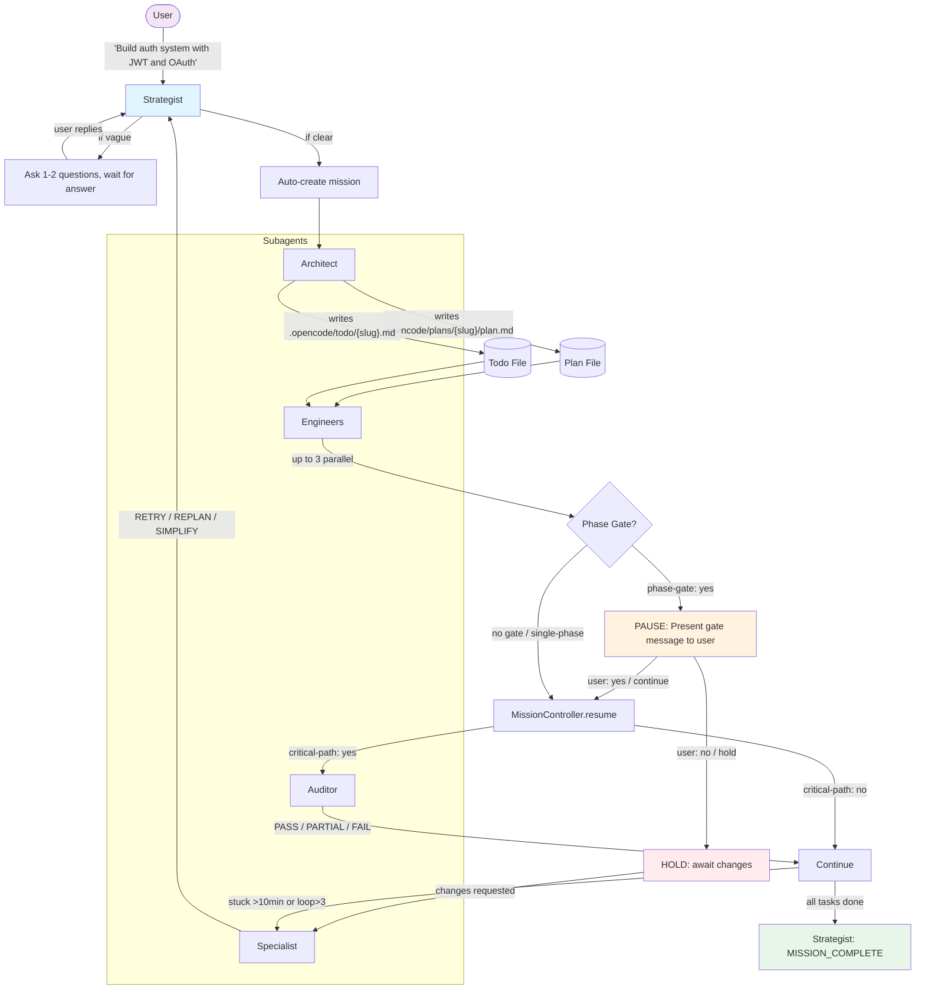
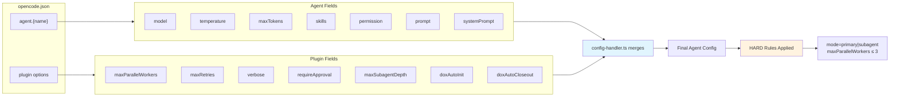
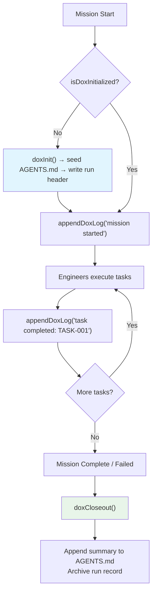

# Architecture

## Agent Pipeline (v2.1.0)

## Execution Flow

### 1. Trigger Phase (Automatic — No Commands)
- Event handler intercepts every user message
- Heuristic detects task requests ("build", "create", "fix", etc.)
- Ignores casual chat ("ok", "thanks", "👍")
- Strategist assesses clarity → asks questions if vague → then auto-creates mission

### 2. Planning Phase (Architect)
- Receives mission description
- Decomposes into logical phases with `## Phase N: Name` headers
- Writes `.opencode/plans/{slug}/plan.md`
- Writes `.opencode/todo/{slug}.md` with:
  - `critical-path: yes/no` — determines if Auditor verifies
  - `phase-gate: yes/no` — determines if mission pauses after phase
  - Dependencies, acceptance criteria, assigned agent

### 3. Execution Phase (Engineers, max 3 parallel)
- MissionController loads todos from `.opencode/todo/{slug}.md`
- Tracks `currentPhase`; detects phase transitions
- Dispatches up to 3 tasks concurrently (Ollama Pro limit)
- Each Engineer gets full context: task description, acceptance criteria, file paths
- Engineer writes evidence back to todo file

### 4. Gate Phase (User-Controlled)
- When a `phase-gate: yes` task completes:
  1. Mission state → `hold`
  2. Gate message written to `.opencode/plans/{slug}/gate-message.txt`
  3. Strategist presents: *"Phase '{name}' is complete. Continue to '{next}'? (yes/no/comment)"*
  4. User reply "yes" → `MissionController.resume()` → next phase dispatches
  5. User reply "no" → stays in `hold`; user can request changes
  6. Change request → Specialist replans remaining phases
- Single-phase missions or plans without gates → skip this entirely, fully automatic

### 5. Verification Phase (Auditor, conditional)
- Only fires for `critical-path: yes` tasks (token efficiency)
- Runs tests, checks regressions, verifies acceptance criteria
- Result: PASS (continue), PARTIAL (list fixes), FAIL (escalate)

### 6. Recovery Phase (Specialist, on stuck detection)
- Triggers on: timeout >10min, retry loop >3, circular deps, all-failed, stalled, resource-exhausted
- Reads `.opencode/DOX/{slug}.md` for historical context
- Diagnosis → resolution strategy: RETRY_WITH_CHANGES, REPLAN, SIMPLIFY, or MANUAL

### 7. Completion Phase (Strategist)
- Collects all results
- Emits `MISSION_COMPLETE` with summary
- DOX closeout: appends run record to `.opencode/AGENTS.md`

---

## Data Flow

---

## State Persistence

All state lives on disk. Compaction-safe.

| File | Purpose | Updated By |
|------|---------|------------|
| `.opencode/plans/{slug}/plan.md` | Architect's plan | Architect |
| `.opencode/plans/{slug}/state.json` | Live mission state | MissionController |
| `.opencode/plans/{slug}/gate-message.txt` | Phase gate message | MissionController |
| `.opencode/todo/{slug}.md` | Task checklist with statuses | Architect, Engineers |
| `.opencode/todo/{slug}.json` | Structured todo export | MissionController |
| `.opencode/DOX/{slug}.md` | Run record (models, timestamps, status) | DOX utils |
| `.opencode/AGENTS.md` | Seeded agent definitions, appended summaries | DOX utils |
| `.opencode/reviews/{slug}.md` | Auditor findings | Auditor |

After compaction event: Strategist re-reads `state.json` + `todo/{slug}.md` to reconstruct context.

---

## Provider Lock (Ollama Only)

Three layers enforce Ollama exclusivity:
1. **Startup**: `config-handler.ts` validates all `agent.{name}.model` starts with `ollama/`
2. **Session creation**: `createSession` rejects non-Ollama models
3. **Runtime**: `chat.params` hook intercepts every LLM call, forces `ollama/*`

No other provider (OpenAI, Anthropic, Google, etc.) can be used.

---

## Built-in Agent Isolation

OpenCode has built-in subagents: `compaction`, `explorer`, `worker`, `executor`, `debugger`.

Our orchestrator agents: `strategist`, `architect`, `engineer`, `auditor`, `specialist`.

| Rule | Implementation |
|------|----------------|
| Namespace separation | Built-ins and orchestrator agents live in separate registries |
| Collision guard | User-defined names matching built-ins get auto-prefixed (`orchestrator-{name}`) |
| Prompt boundaries | Every agent prompt: "NEVER interact with built-in OpenCode agents" |
| Compaction resilience | State stored on disk; re-read after compaction |

---

## DOX Framework Integration

---

## Anti-Stuck Detection

| Condition | Detector | Resolution |
|-----------|----------|------------|
| Timeout >10min | Task timer | Specialist diagnoses, suggests retry/replan |
| Retry loop >3 | Retry counter | Specialist suggests new approach |
| Circular dependencies | Dependency graph validation | Reject plan, ask Architect to fix |
| All tasks failed | Completion check | Simplify scope, retry with reduced requirements |
| Stalled (no progress) | Progress tracker | Throttle workers, check Ollama queue |
| Resource exhausted | Token/queue monitor | Pause, wait, resume when capacity available |
